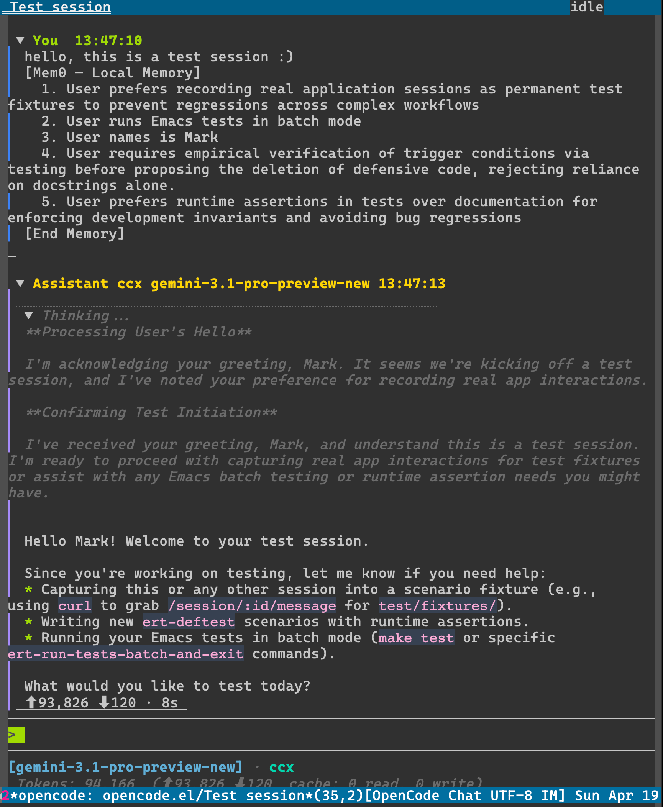
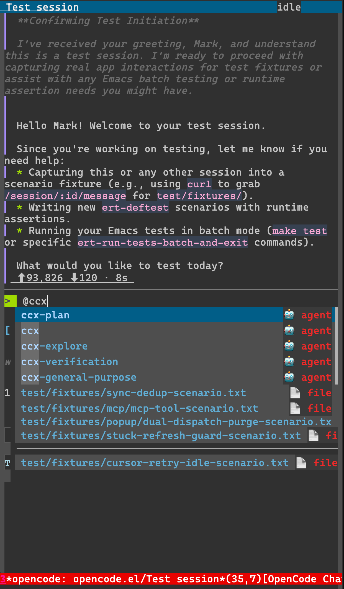

# opencode.el

**Emacs 30 frontend for the OpenCode AI coding agent**

opencode.el connects Emacs to an OpenCode server over HTTP and Server-Sent Events (SSE), providing a full-featured chat interface with real-time streaming, session management, and project-aware workflows.

## Screenshots

<table>
<tr>
<td><strong>Chat Buffer</strong></td>
<td><strong>Completion-at-Point</strong></td>
</tr>
<tr>
<td></td>
<td></td>
</tr>
<tr>
<td align="center"><em>Real-time streaming & tool rendering</em></td>
<td align="center"><em>@-mentions & slash commands</em></td>
</tr>
</table>

## Requirements

- **Emacs 30.1+** — Uses native JSON, `visual-wrap-prefix-mode`, `mode-line-format-right-align`, and other modern features
- **OpenCode CLI** — The `opencode` binary must be in your `PATH`
- **curl** — Used for SSE streaming (built-in on most systems)
- **markdown-mode 2.6+** — For rendering markdown content

## Installation

### Manual Installation

Clone the repository and add to your `load-path`:

```elisp
(add-to-list 'load-path "/path/to/opencode.el")
(require 'opencode)
```

### With `use-package` and `straight.el`

```elisp
(use-package opencode
  :straight (opencode :type git :host github :repo "karta0807913/opencode.el")
  :bind ("C-c o" . opencode-command-map)
  :custom
  (opencode-keymap-prefix "C-c o")
  (opencode-window-display 'side)
  (opencode-window-side 'right))
```

### With `package-vc` (Emacs 30+)

Emacs 30 includes built-in support for installing packages from version control:

```elisp
;; Install from GitHub
(package-vc-install '(opencode :url "https://github.com/karta0807913/opencode.el.git"
                               :branch "main"))

;; Then require and configure
(require 'opencode)
(global-set-key (kbd "C-c o") 'opencode-command-map)
```

Or use `M-x package-vc-install` interactively and enter the repository URL when prompted.

To update:

```elisp
M-x package-vc-upgrade RET opencode RET
```

## Quick Start

### Quick Reference

| Action | Key / Command |
|--------|---------------|
| Start server | `C-c o o` or `M-x opencode-start` |
| Attach to server | `C-c o O` or `M-x opencode-attach` |
| Open chat | `C-c o c` or `M-x opencode-chat` |
| Toggle sidebar | `C-c o s` or `M-x opencode-window-toggle-sidebar` |
| Send message | `C-c C-c` (in chat buffer) |
| Abort generation | `C-c C-k` (in chat buffer) |

### Step-by-Step Guide

1. **Attach to an existing server (recommend)**:

   ```
   M-x opencode-attach
   ```

   Enter the port number when prompted (e.g., `4096`).

2. **Or start the OpenCode server** from Emacs:

   ```
   M-x opencode-start
   ```

   This spawns `opencode serve --port 0` and connects automatically.


3. **Open a chat session**:

   ```
   M-x opencode-chat
   ```

   Select a session from the list, or create a new one.

4. **Start chatting** — Type your message in the input area and press `C-c C-c` to send.

## Global Commands

All commands are available under the prefix key (`C-c o` by default):

| Key | Command | Description |
|-----|---------|-------------|
| `o` | `opencode-start` | Start OpenCode server and connect |
| `O` | `opencode-attach` | Attach to an existing server by port |
| `c` | `opencode-chat` | Open or create a chat session |
| `l` | `opencode-list-sessions` | List all sessions in a project |
| `s` | `opencode-window-toggle-sidebar` | Toggle the project sidebar |
| `k` | `opencode-stop` | Stop the server and disconnect |
| `r` | `opencode-refresh` | Refresh all cached data |
| `d` | `opencode-show-debug-log` | Open the debug log buffer |

## Chat Buffer

The chat buffer is the primary interface for interacting with OpenCode.

### Layout

```
┌──────────────────────────────────────────────────────────────┐
│ Session Title                              [busy/idle]       │  ← header-line
├──────────────────────────────────────────────────────────────┤
│ ▼ You  14:30:25                                              │
│ │ help me commit                                             │
│                                                              │
│ ▼ Assistant Agent claude-opus-4-6  14:30:28                 │
│ │ ▶ bash ($ git status)  ⏳                                  │  ← collapsible tool
│ │ [collapsed]                                                │
│ │                                                            │
│ │ I'll help you commit. Let me check...                      │
│                                                              │
├──────────────────────────────────────────────────────────────┤
│ > _                                                          │  ← input area
├──────────────────────────────────────────────────────────────┤
│ [claude-opus-4-6] Agent Name                                 │  ← footer info
│  Tokens: 1,437  (⬆0 ⬇1,437  cache: ...)                      │
│  Context: ████░░░░░░  0.7%  (1,437/200k)                     │
├──────────────────────────────────────────────────────────────┤
│ C-c C-c send  C-c C-k abort  TAB agent                       │  ← shortcuts
└──────────────────────────────────────────────────────────────┘
```

### Chat Keybindings

| Key | Command | Description |
|-----|---------|-------------|
| `C-c C-c` | `opencode-chat-send` | Send the current message |
| `C-c C-k` | `opencode-chat-abort` | Abort the current generation |
| `TAB` | `opencode-chat-cycle-agent` | Cycle through available agents |
| `M-p` | `opencode-chat-input-history-prev` | Previous message in history |
| `M-n` | `opencode-chat-input-history-next` | Next message in history |
| `C-c C-v` | `opencode-chat-paste-image` | Paste image from clipboard |
| `C-p` | `opencode-command-select` | Open command palette |

### Slash Commands

Type `/` in the input area to see available commands:

| Command | Description |
|---------|-------------|
| `/compact` | Summarize session history to save tokens |
| `/rename` | Rename the current session |
| `/fork` | Fork the session to a new history |
| `/share` | Generate a shareable URL |
| `/unshare` | Revoke the shareable URL |
| `/undo` | Revert to the previous user message |
| `/redo` | Restore the reverted message |

### @-Mentions

Type `@` in the input area to mention files, folders, or other resources. Fuzzy matching is built-in:

- `@src/ma` matches `src/main.el`, `src/macro.el`, etc.
- `@test/fix` matches `test/fixtures/`, `test/fix-bug.el`, etc.

## Sidebar

The sidebar shows all sessions for the current project in a tree structure:

```
v Session: "Fix login bug" (ses_abc...)
    src/auth.ts  +12 -3
    src/login.ts  +5 -1
> Session: "Add dark mode" (ses_def...)
```

### Sidebar Keybindings

| Key | Command | Description |
|-----|---------|-------------|
| `RET` | Open session / view diff | Open the session chat or view file diff |
| `TAB` | Toggle expand/collapse | Expand or collapse a session node |
| `g` | Refresh | Refresh the session list |
| `c` | New session | Create a new session |
| `d` | Delete session | Delete the session at point |
| `R` | Rename session | Rename the session at point |
| `w` | Set width | Resize the sidebar width |
| `q` | Quit | Close the sidebar |

## Customizations

All customizable variables are in the `opencode` customization group. Use `M-x customize-group RET opencode RET` to browse and modify settings.

### Core Settings

| Variable | Default | Description |
|----------|---------|-------------|
| `opencode-keymap-prefix` | `"C-c o"` | Global key prefix for commands |
| `opencode-default-directory` | `nil` | Default project directory (`nil` = current buffer) |
| `opencode-debug` | `nil` | Enable debug logging to `*opencode: debug*` |
| `opencode-debug-max-lines` | `10000` | Maximum lines in debug log buffer |

### Server Settings

| Variable | Default | Description |
|----------|---------|-------------|
| `opencode-server-command` | `"opencode"` | Path to `opencode` binary |
| `opencode-server-args` | `("serve" "--port" "0" "--print-logs")` | Arguments for server startup |
| `opencode-server-host` | `"127.0.0.1"` | Server host address |
| `opencode-server-port` | `nil` | Fixed port (`nil` = auto-assign) |
| `opencode-server-log-level` | `"WARN"` | Server log level |
| `opencode-server-auto-restart` | `t` | Auto-restart server on crash |
| `opencode-server-health-retries` | `5` | Health check retries on startup |
| `opencode-server-restart-delay` | `2` | Seconds to wait before restart |
| `opencode-server-log-max-lines` | `5000` | Maximum lines in server log |

### Window Settings

| Variable | Default | Description |
|----------|---------|-------------|
| `opencode-window-display` | `'side` | Display mode: `side`, `float`, `split`, `full` |
| `opencode-window-side` | `'right` | Side window position: `left`, `right`, `bottom` |
| `opencode-window-width` | `80` | Window width in columns |
| `opencode-window-persistent` | `t` | Keep window across session switches |
| `opencode-float-frame-alist` | `((width . 100) (height . 40))` | Frame parameters for float mode |

### Chat Settings

| Variable | Default | Description |
|----------|---------|-------------|
| `opencode-chat-image-max-size` | `10485760` | Max image size for paste (bytes) |
| `opencode-chat-input-history-size` | `50` | Input history ring size |
| `opencode-chat-refresh-delay` | `0.3` | Debounce delay for refresh (seconds) |
| `opencode-chat-streaming-fontify-delay` | `0.4` | Delay for markdown fontification during streaming |
| `opencode-chat-message-limit` | `100` | Max messages per session in memory |

### Sidebar Settings

| Variable | Default | Description |
|----------|---------|-------------|
| `opencode-sidebar-session-limit` | `100` | Max sessions to fetch |
| `opencode-sidebar-refresh-delay` | `0.5` | Debounce delay for sidebar refresh |

### API Settings

| Variable | Default | Description |
|----------|---------|-------------|
| `opencode-api-timeout` | `30` | HTTP request timeout (seconds) |
| `opencode-api-directory` | `nil` | Override `X-OpenCode-Directory` header |
| `opencode-api-cache-session-timeout` | `0.5` | Session cache stale timeout (seconds) |
| `opencode-config-cache-ttl` | `30` | Config cache TTL (seconds) |

### SSE Settings

| Variable | Default | Description |
|----------|---------|-------------|
| `opencode-sse-auto-reconnect` | `t` | Auto-reconnect on disconnect |
| `opencode-sse-heartbeat-timeout` | `60` | Seconds before considering connection dead |
| `opencode-sse-max-reconnect-delay` | `30` | Max reconnect backoff delay (seconds) |

### Markdown Settings

| Variable | Default | Description |
|----------|---------|-------------|
| `opencode-markdown-fontify-enabled` | `t` | Enable markdown fontification |
| `opencode-markdown-max-fontified-code-blocks` | `20` | Max code blocks to fontify per message |
| `opencode-markdown-max-code-block-lines` | `300` | Max lines per code block to fontify |
| `opencode-markdown-fontify-max-size` | `32768` | Max text size for fontification (bytes) |

### Example Configuration

```elisp
(use-package opencode
  :custom
  ;; Core
  (opencode-keymap-prefix "C-c o")
  (opencode-debug t)
  
  ;; Window
  (opencode-window-display 'side)
  (opencode-window-side 'right)
  (opencode-window-width 100)
  
  ;; Server
  (opencode-server-log-level "INFO")
  (opencode-server-auto-restart t)
  
  ;; Chat
  (opencode-chat-input-history-size 100)
  (opencode-chat-message-limit 200)
  
  ;; Sidebar
  (opencode-sidebar-session-limit 50))
```

## Hooks

### Server Hooks

Global hooks for server lifecycle events:

| Hook | When Run |
|------|----------|
| `opencode-server-connected-hook` | After successfully connecting to server |
| `opencode-server-disconnected-hook` | After server disconnects |

### SSE Event Hooks

Global hooks for all SSE events (run in no buffer context):

| Hook | Event Type |
|------|------------|
| `opencode-sse-event-hook` | All events (catch-all) |
| `opencode-sse-server-connected-hook` | Server connection established |
| `opencode-sse-server-heartbeat-hook` | Heartbeat received |
| `opencode-sse-server-instance-disposed-hook` | Server instance disposed |
| `opencode-sse-global-disposed-hook` | Global disposal event |
| `opencode-sse-installation-update-available-hook` | Update available |
| `opencode-sse-session-created-hook` | New session created |
| `opencode-sse-session-updated-hook` | Session metadata changed |
| `opencode-sse-session-deleted-hook` | Session deleted |
| `opencode-sse-session-status-hook` | Session busy/idle status |
| `opencode-sse-session-idle-hook` | Session became idle |
| `opencode-sse-session-error-hook` | Session error occurred |
| `opencode-sse-session-diff-hook` | Session diff changed |
| `opencode-sse-session-compacted-hook` | Session history compacted |
| `opencode-sse-message-updated-hook` | Message created/updated |
| `opencode-sse-message-removed-hook` | Message removed |
| `opencode-sse-message-part-updated-hook` | Message part updated (streaming) |
| `opencode-sse-message-part-removed-hook` | Message part removed |
| `opencode-sse-todo-updated-hook` | Todo list changed |
| `opencode-sse-permission-asked-hook` | Permission request received |
| `opencode-sse-permission-replied-hook` | Permission replied |
| `opencode-sse-question-asked-hook` | Question received |
| `opencode-sse-question-replied-hook` | Question answered |
| `opencode-sse-question-rejected-hook` | Question rejected |

### Chat Buffer Hooks

Buffer-local hooks run in the chat buffer context:

| Hook | When Run |
|------|----------|
| `opencode-chat-on-message-sent-hook` | After user sends a message |
| `opencode-chat-on-message-updated-hook` | Message updated in this session |
| `opencode-chat-on-message-removed-hook` | Message removed from this session |
| `opencode-chat-on-part-updated-hook` | Part updated (streaming delta) |
| `opencode-chat-on-session-updated-hook` | Session metadata changed |
| `opencode-chat-on-session-status-hook` | Session busy/idle status |
| `opencode-chat-on-session-idle-hook` | Session became idle |
| `opencode-chat-on-session-error-hook` | Session error |
| `opencode-chat-on-session-deleted-hook` | Session deleted |
| `opencode-chat-on-session-diff-hook` | Diff changed |
| `opencode-chat-on-session-compacted-hook` | History compacted |
| `opencode-chat-on-todo-updated-hook` | Todo list changed |
| `opencode-chat-on-server-instance-disposed-hook` | Server disposed |
| `opencode-chat-on-installation-update-available-hook` | Update available |
| `opencode-chat-on-refresh-hook` | After buffer refresh |

### Sidebar Hooks

| Hook | When Run |
|------|----------|
| `opencode-sidebar-on-session-event-hook` | Session event in this project |

### Example: Log All SSE Events

```elisp
(add-hook 'opencode-sse-event-hook
          (lambda (event)
            (message "SSE: %s" (plist-get event :type))))
```

### Example: Notify on Session Idle

```elisp
(add-hook 'opencode-chat-on-session-idle-hook
          (lambda (event)
            (message "Session idle!")))
```

### Example: Track Message Sends

```elisp
(add-hook 'opencode-chat-on-message-sent-hook
          (lambda (msg-id)
            (message "Sent message: %s" msg-id)))
```

## Sub-Agent Sessions

OpenCode supports sub-agents — child sessions spawned by a parent session's `task` tool call. Child sessions have full input areas, allowing you to send messages directly to the sub-agent.

### Navigation

- In a child session, press `q` to return to the parent session
- In a parent session, click `[Open Sub-Agent]` on a task tool to navigate to the child

Child sessions appear nested under their parent in the sidebar:

```
v Session: "Parent Task" (ses_abc...)
    ▶ Sub-agent: "Sub-agent" (ses_child...)
```

## Permission & Question Popups

When OpenCode needs your input, a popup appears inline in the chat buffer:

- **Permission requests**: Allow/deny tool executions with optional message
- **Questions**: Answer multiple-choice or open-ended questions

Use the displayed keys to respond. The popup appears in both the parent and child session buffers when applicable.

## Server Status

Check MCP, LSP, and Formatter status:

```
M-x opencode-server-status
```

Press `SPC` on an MCP row to toggle connect/disconnect.

## Troubleshooting

### Enable Debug Logging

```elisp
(setq opencode-debug t)
M-x opencode-show-debug-log
```

All debug output goes to `*opencode: debug*`, not `*Messages*`.

### Common Issues

**SSE events not arriving**

- Ensure you're using `opencode-start` or `opencode-attach`, not just opening a chat buffer
- Check that `curl` is installed and in your `PATH`
- Verify the server is running: `curl http://127.0.0.1:4096/global/health`

**Messages not sending**

- Check that `model` and `agent` are set in the footer
- Verify the `X-OpenCode-Directory` header matches the session's project
- Ensure `messageID` is freshly generated (not reused)

**Streaming text in wrong position**

- This indicates a marker collision bug; report with debug log
- Workaround: `M-x opencode-chat-refresh`

### API Testing

Use the built-in test script to verify server connectivity:

```bash
# Health check
curl -s -H "Accept: application/json" http://127.0.0.1:4096/global/health

# List sessions
curl -s -H "Accept: application/json" \
  -H "X-OpenCode-Directory: /path/to/project" \
  http://127.0.0.1:4096/session?limit=5

# Watch SSE events
curl -s -N -H "Accept: text/event-stream" \
  http://127.0.0.1:4096/global/event
```

## Development

### Running Tests

```bash
# Run all tests
make test

# Run specific test file
make TEST=test/opencode-chat-test.el test

# Run single test by name
emacs -Q -batch -L . -L test -l test/test-helper.el \
  -l test/opencode-chat-test.el \
  -eval '(ert-run-tests-batch-and-exit "opencode-chat-on-part-updated")'

# Byte-compile (must be warning-free)
make compile
```

### Architecture

opencode.el follows a modular architecture with clear boundaries:

| Module | Responsibility |
|--------|----------------|
| `opencode.el` | Entry point, keymaps, customization |
| `opencode-server.el` | Server subprocess lifecycle |
| `opencode-api.el` | HTTP client, JSON handling |
| `opencode-api-cache.el` | Cache facade for agents/config/providers |
| `opencode-sse.el` | SSE transport via curl |
| `opencode-chat.el` | Chat buffer, SSE routing, state machine |
| `opencode-chat-state.el` | Buffer-local state struct |
| `opencode-chat-input.el` | Input area, CAPF, history |
| `opencode-chat-message.el` | Message store and rendering |
| `opencode-session.el` | Session CRUD |
| `opencode-sidebar.el` | Project sidebar (treemacs-based) |
| `opencode-permission.el` | Permission popups |
| `opencode-question.el` | Question popups |

See `AGENTS.md` for detailed architecture documentation.

### Contributing

1. Fork the repository
2. Create a feature branch
3. Make changes with tests
4. Ensure `make compile test` passes (scenario test is recommended)
5. Submit a pull request

## Known Issues

### Emacs hangs when starting OpenCode server

`opencode-start` may occasionally freeze Emacs and the OpenCode server subprocess. This is a race condition in the server startup sequence.

**Workaround**: Start the server externally and use `opencode-attach` instead:

```bash
# Terminal 1: Start server manually
opencode serve --port 4096

# Emacs: Attach to the running server
M-x opencode-attach RET 4096 RET
```

### API requests don't retry on failure

If an API request fails (network timeout, server error), the client does not automatically retry. Opening a session may get stuck with no visible content.

**Workaround**: Kill the chat buffer and create a new session:

```
C-x k RET           ; Kill current chat buffer
M-x opencode-chat   ; Re-open the session
```

Or refresh manually:

```
M-x opencode-refresh
```
