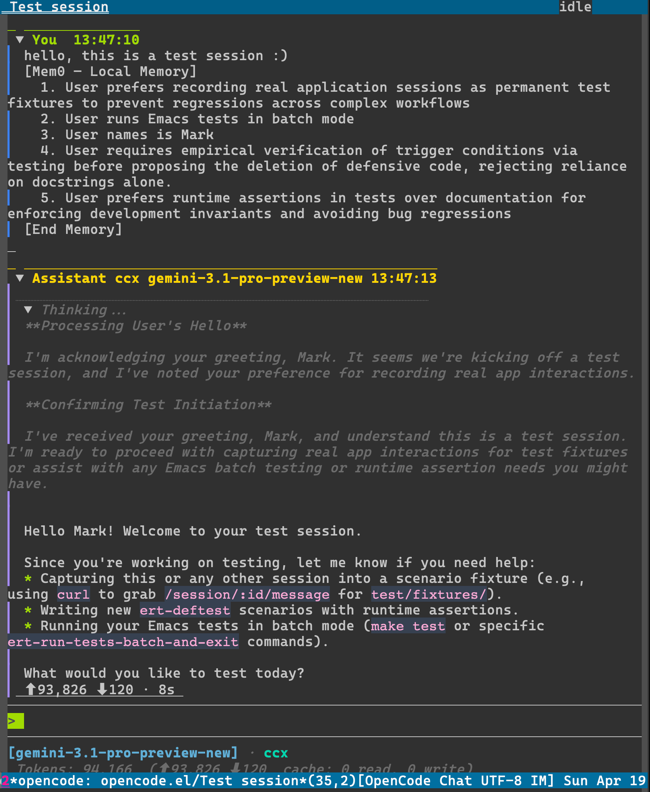
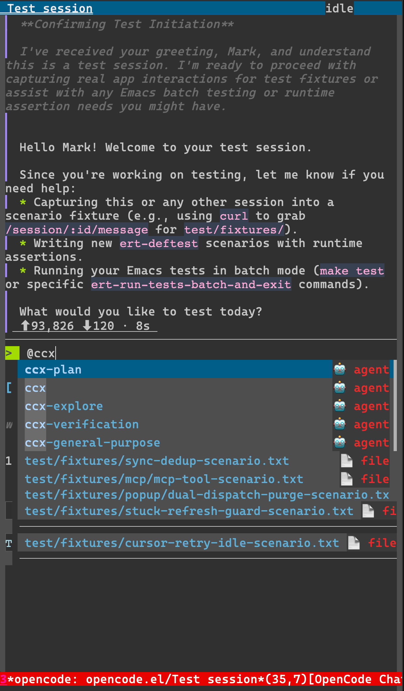

# opencode.el

**Emacs 30 frontend for the OpenCode and Pi AI coding agents**

opencode.el connects Emacs to an OpenCode server over HTTP and Server-Sent
Events (SSE), or to a Pi agent using newline-delimited JSON over a
`pi --mode rpc` subprocess. It provides a shared chat interface with real-time
streaming, session management, and project-aware workflows.

## Screenshots

<table>
<tr>
<td><strong>Chat Buffer</strong></td>
<td><strong>Completion-at-Point</strong></td>
</tr>
<tr>
<td></td>
<td></td>
</tr>
<tr>
<td align="center"><em>Real-time streaming & tool rendering</em></td>
<td align="center"><em>@-mentions & slash commands</em></td>
</tr>
</table>

## Requirements

- **Emacs 30.1+** — Uses native JSON, `visual-wrap-prefix-mode`, `mode-line-format-right-align`, and other modern features
- **OpenCode CLI** — The `opencode` binary must be in your `PATH` when
  opencode.el starts a managed server. It is not required when attaching to
  an already-running server.
- **Pi CLI** — The `pi` binary must be in your `PATH` when using the optional Pi backend
- **curl** — Used for SSE streaming (built-in on most systems)
- **markdown-mode 2.6+** — For rendering markdown content

## Installation

### Manual Installation

Clone the repository and add to your `load-path`:

```elisp
(add-to-list 'load-path "/path/to/opencode.el")
(require 'opencode)
```

### With `use-package` and `straight.el`

```elisp
(use-package opencode
  :straight (opencode :type git :host github :repo "karta0807913/opencode.el")
  :bind ("C-c o" . opencode-command-map)
  :custom
  (opencode-keymap-prefix "C-c o")
  (opencode-window-display 'side)
  (opencode-window-side 'right))
```

### With `package-vc` (Emacs 30+)

Emacs 30 includes built-in support for installing packages from version control:

```elisp
;; Install from GitHub
(package-vc-install '(opencode :url "https://github.com/karta0807913/opencode.el.git"
                               :branch "main"))

;; Then require and configure
(require 'opencode)
(global-set-key (kbd "C-c o") 'opencode-command-map)
```

Or use `M-x package-vc-install` interactively and enter the repository URL when prompted.

To update:

```elisp
M-x package-vc-upgrade RET opencode RET
```

## Quick Start

### Quick Reference

| Action           | Key / Command                               |
|------------------|---------------------------------------------|
| Start/connect    | `C-c o o` or `M-x opencode-start`           |
| Attach by URL    | `C-c o O` or `M-x opencode-attach`          |
| Open chat        | `C-c o c` or `M-x opencode-chat`            |
| New session      | `C-c o n` or `M-x opencode-new-session`     |
| Toggle sidebar   | `C-c o t` or `M-x opencode-toggle-sidebar`  |
| Refresh          | `C-c o r` or `M-x opencode-refresh`         |
| Disconnect       | `C-c o q` or `M-x opencode-disconnect`      |
| Send message     | `C-c C-c` in a chat buffer                  |
| Abort generation | `C-c C-k` in a chat buffer, or `C-c o a`   |

### Step-by-Step Guide

1. **Attach to an existing server by URL**:

   ```
   M-x opencode-attach
   ```

   Enter the OpenCode server URL, for example
   `http://127.0.0.1:4096` or `http://remote-host:4096`.
   The current transport supports an HTTP base URL with an explicit port;
   URL paths and HTTPS are not supported. With a prefix argument,
   `opencode-attach` also prompts for the project directory.

2. **Or start/connect from Emacs**:

   ```
   M-x opencode-start
   ```

   By default, this starts a managed `opencode serve --port 0` subprocess,
   waits for its assigned port, checks its health, and connects automatically.
   If `opencode-server-port` is configured, it does not start a subprocess;
   it connects to the existing server at
   `opencode-server-host:opencode-server-port`.


3. **Open a chat session**:

   ```
   M-x opencode-chat
   ```

   Select a session from the list, or create a new one.

4. **Start chatting** — Type your message in the input area and press `C-c C-c` to send.

To use Pi instead, run `M-x opencode-pi`. It offers existing on-disk Pi
sessions plus a new-session option, starts `pi --mode rpc`, and opens the same
chat interface using the Pi backend.

### Pi Backend Notes

Each Pi chat uses its own `pi --mode rpc` subprocess. Pi supports messages,
streaming, tools, model selection, and push-driven permission/question popups.
Those popups use the same inline UI as OpenCode sessions: OpenCode delivers
requests over SSE, while Pi delivers normalized extension UI requests over the
JSONL RPC subprocess.
OpenCode-only features such as project discovery, diffs, todos, sharing, and
undo/redo are hidden or unavailable in Pi sessions.

## Global Commands

All commands are available under the prefix key (`C-c o` by default):

| Key | Command                   | Description                                  |
|-----|---------------------------|----------------------------------------------|
| `o` | `opencode-start`          | Start a managed server, or connect when a port is configured |
| `O` | `opencode-attach`         | Attach to an existing server by URL          |
| `c` | `opencode-chat`           | Open or create a chat session                |
| `n` | `opencode-new-session`    | Create and open a new session                |
| `a` | `opencode-abort`          | Abort the active generation                  |
| `t` | `opencode-toggle-sidebar` | Toggle the project sidebar                   |
| `q` | `opencode-disconnect`     | Disconnect; stop the server only in managed mode |
| `r` | `opencode-refresh`        | Refresh cached data and open buffers         |

The debug log is available separately with
`M-x opencode-show-debug-log`.

## Chat Buffer

The chat buffer is the primary interface for interacting with either backend.

### Layout

```
┌──────────────────────────────────────────────────────────────┐
│ Session Title                              [busy/idle]       │  ← header-line
├──────────────────────────────────────────────────────────────┤
│ ▼ You  14:30:25                                              │
│ │ help me commit                                             │
│                                                              │
│ ▼ Assistant Agent claude-opus-4-6  14:30:28                  │
│ │ ▶ bash ($ git status)  ⏳                                  │  ← collapsible tool
│ │ [collapsed]                                                │
│ │                                                            │
│ │ I'll help you commit. Let me check...                      │
│                                                              │
├──────────────────────────────────────────────────────────────┤
│ > _                                                          │  ← input area
├──────────────────────────────────────────────────────────────┤
│ [claude-opus-4-6] Agent Name                                 │  ← footer info
│  Tokens: 1,437  (⬆0 ⬇1,437  cache: ...)                     │
│  Context: ████░░░░░░  0.7%  (1,437/200k)                     │
├──────────────────────────────────────────────────────────────┤
│ C-c C-c send  C-c C-k abort  C-c C-a attach  TAB agent       │  ← shortcuts
│ C-c g refresh  C-c C-v image                                 │
└──────────────────────────────────────────────────────────────┘
```

### Chat Keybindings

| Key       | Action                                     |
|-----------|--------------------------------------------|
| `C-c C-c` | Send the current message                   |
| `C-c C-k` | Abort the current generation               |
| `C-c C-a` | Insert `@` and start attachment completion |
| `C-c g`   | Refresh the chat buffer                    |
| `TAB`     | Cycle to the next agent                    |
| `S-TAB`   | Cycle to the previous agent                |
| `C-t`     | Cycle the model variant                    |
| `M-p`     | Move to the previous message               |
| `M-n`     | Move to the next message                   |
| `C-k`     | Previous input-history entry               |
| `C-j`     | Next input-history entry                   |
| `C-c C-v` | Paste an image from the clipboard          |
| `C-p`     | Open the command palette                   |

When reopening a session, opencode.el restores the last known model variant
from the conversation when available. The active variant is shown in the
footer.

### Command Palette

Press `C-p` in a chat buffer to run opencode.el's local session commands:

| Command    | Description                                                   |
|------------|---------------------------------------------------------------|
| `/compact` | Compact/summarize the current session                         |
| `/model`   | Select a different model                                      |
| `/rename`  | Rename the current session                                    |
| `/fork`    | Fork the session to a new history                             |
| `/share`   | Generate a shareable URL                                      |
| `/unshare` | Revoke the shareable URL                                      |
| `/undo`    | Revert the previous user message                              |
| `/redo`    | Restore the reverted message                                  |
| `/btw`     | Side conversation: fork on OpenCode; Pi extension passthrough |

### Slash Commands

Type `/` in the input area to complete commands supplied by the OpenCode
server. Sending a slash command forwards it to the active backend. `/btw` is
special: on OpenCode it opens a forked side conversation; on Pi it is passed
through to the user's `pi-btw` extension.

### @-Mentions

Type `@` in the input area to mention files, folders, or other resources. Fuzzy matching is built-in:

- `@src/ma` matches `src/main.el`, `src/macro.el`, etc.
- `@test/fix` matches `test/fixtures/`, `test/fix-bug.el`, etc.

## Sidebar

The sidebar is global. It groups opened sessions across projects, active
pipeline executions, the primary project, and other discovered OpenCode
projects:

```
v Session: "Fix login bug" (ses_abc...)
    src/auth.ts  +12 -3
    src/login.ts  +5 -1
> Session: "Add dark mode" (ses_def...)
```

### Sidebar Keybindings

| Key       | Action                                                   |
|-----------|----------------------------------------------------------|
| `RET`     | Open the session or node at point                        |
| `TAB`     | Toggle expand/collapse                                   |
| `g` / `r` | Refresh the project group or sidebar                     |
| `c`       | Create a new session                                     |
| `C`       | Choose an OpenCode project, then create a session         |
| `d`       | Delete the session or close the item at point             |
| `R`       | Rename the session at point                              |
| `w`       | Resize the sidebar                                       |
| `o s`     | Open the session in a horizontal split                   |
| `o v`     | Open the session in a vertical split                     |

Additional navigation and quit bindings are inherited from Treemacs.

### Diff Navigation

Open a session file node in the sidebar to view its diff. In a diff buffer,
use `n`/`p` to move between files, `RET` or `o` to open the file at point,
`r` to revert, `g` to refresh, and `q` to quit. In chat, `RET` or `o` on an
`edit` or `apply_patch` body opens the affected file near the corresponding
line.

## Pipeline Workflows

`opencode-pipeline` chains chat sessions into an event-driven workflow. Each
stage owns one session; retries and rollbacks send another turn to that same
session.

```elisp
(let* ((review
        (opencode-pipeline-template
         :title "Review"
         :agent "plan"
         :prompt (lambda (implementation)
                   (format "Review this implementation:\n\n%s"
                           implementation))
         :next-operation
         (lambda (review)
           (if (string-match-p "\\bRETRY\\b" review)
               'rollback
             'stop))))
       (implement
        (opencode-pipeline-template
         :title "Implement"
         :agent "build"
         :prompt (lambda (input)
                   (format "Implement this request:\n\n%s" input))
         :next review)))
  (setq my-run
        (opencode-pipeline-start
         implement
         :input "Add tests for the chat renderer"
         :title "Chat renderer tests"
         :directory "/path/to/project"
         :max-executions 6
         :debug t)))

(opencode-pipeline-describe my-run)
```

`opencode-pipeline-template` returns a reusable stage template struct. Keep
templates in lexical bindings and connect stages with direct struct references;
cycles can be wired after creation with `setf` on
`opencode-pipeline-node-template-next`. Important stage properties include:

- `:prompt` — a non-empty string or function. A function receives the previous
  stage's output, or the `:input` passed to `opencode-pipeline-start` for the
  entry stage. It may accept a second argument containing the previous runtime
  stage.
- `:next` — the next stage template struct.
- `:next-operation` — receives the current output and returns `'next`,
  `'retry`, `'rollback`, or `'stop`. It may accept the current runtime stage as
  a second argument.
- `:retry-count` — maximum retries for that stage.
- `:session-id` — reuse an existing session instead of creating one lazily.
- `:agent`, `:model`, `:variant`, and `:backend` — per-stage prompt settings.
- `:on-create` — callback run once in the stage's chat buffer after its
  session is bound. Use `opencode-pipeline-stage-buffer` to retrieve a live
  stage buffer later without creating or displaying one.

Start an execution with
`(opencode-pipeline-start PIPELINE &key input title directory debug max-executions)`.
PIPELINE must be the entry template struct. All stages in one execution must
use the same project directory.
`:max-executions` limits total prompts when positive; `nil`, zero, and negative
values mean unlimited execution.

Active executions appear in the sidebar's Pipeline group. In
`opencode-pipeline-describe`, use `n`/`p` to select stages, `RET` to open a
stage chat, `v` to toggle SVG/text views, `g` to refresh, `s` to stop, and `x`
to reset. `opencode-pipeline-stop` preserves sessions; reset removes only the
execution record. `opencode-pipeline-state-changed-hook` receives
`(EXECUTION NODE-SYMBOL REASON)` after state changes.

## Customizations

All customizable variables are in the `opencode` customization group. Use `M-x customize-group RET opencode RET` to browse and modify settings.

### Core Settings

| Variable                     | Default     | Description                                        |
|------------------------------|-------------|----------------------------------------------------|
| `opencode-keymap-prefix`     | `"C-c o"`   | Global key prefix for commands                     |
| `opencode-default-directory` | `nil`       | Default project directory (`nil` = current buffer) |
| `opencode-backend-current`   | `'opencode` | Default backend                                    |
| `opencode-debug`             | `nil`       | Enable debug logging to `*opencode: debug*`        |
| `opencode-debug-max-lines`   | `10000`     | Maximum lines in debug log buffer                  |

### Server Settings

| Variable                         | Default                                 | Description |
|----------------------------------|-----------------------------------------|-------------|
| `opencode-server-command`        | `"opencode"`                            | Binary used for managed startup |
| `opencode-server-args`           | `("serve" "--port" "0" "--print-logs")` | Arguments for managed startup |
| `opencode-server-host`           | `"127.0.0.1"`                           | Managed listen host, or target host in connect mode |
| `opencode-server-port`           | `nil`                                   | `nil` starts a managed server; a number connects to an existing server |
| `opencode-server-username`       | `"opencode"`                            | Basic-auth username, used when a password is configured |
| `opencode-server-password`       | `nil`                                   | Basic-auth password (`nil` disables authentication) |
| `opencode-server-log-level`      | `"WARN"`                                | Managed server log level |
| `opencode-server-auto-restart`   | `t`                                     | Restart the managed subprocess after a crash |
| `opencode-server-health-retries` | `5`                                     | Health-check attempts during startup or attach |
| `opencode-server-restart-delay`  | `2`                                     | Delay before restarting a managed subprocess |
| `opencode-server-log-max-lines`  | `5000`                                  | Maximum retained server-log lines |

`opencode-attach` reads an HTTP server URL and stores its host and port in
`opencode-server-host` and `opencode-server-port`. Setting those variables
directly uses the same existing-server connection path.

### Window Settings

| Variable                     | Default                         | Description                                     |
|------------------------------|---------------------------------|-------------------------------------------------|
| `opencode-window-display`    | `'side`                         | Display mode: `side`, `float`, `split`, `full`  |
| `opencode-window-side`       | `'right`                        | Side window position: `left`, `right`, `bottom` |
| `opencode-window-width`      | `80`                            | Window width in columns                         |
| `opencode-window-persistent` | `t`                             | Keep window across session switches             |
| `opencode-float-frame-alist` | `((width . 100) (height . 40))` | Frame parameters for float mode                 |

### Chat Settings

| Variable                               | Default                 | Description                                                |
|----------------------------------------|-------------------------|------------------------------------------------------------|
| `opencode-chat-image-max-size`         | `10485760`              | Max image size for paste (bytes)                           |
| `opencode-chat-input-history-size`     | `50`                    | Input history ring size                                    |
| `opencode-chat-refresh-delay`          | `0.3`                   | Debounce delay for refresh (seconds)                       |
| `opencode-chat-message-limit`          | `100`                   | Max messages per session in memory                         |
| `opencode-chat-tool-renderers`         | Built-in renderer alist | Default renderer and collapse behavior for each tool       |
| `opencode-chat-tool-output-max-lines`  | `-1`                    | Maximum rendered tool-output lines (`-1` = unlimited)      |
| `opencode-chat-tool-output-max-chars`  | `-1`                    | Maximum rendered tool-output characters (`-1` = unlimited) |

### Sidebar Settings

| Variable                         | Default | Description                        |
|----------------------------------|---------|------------------------------------|
| `opencode-sidebar-refresh-delay` | `0.5`   | Debounce delay for sidebar refresh |

`opencode-sidebar-session-limit` remains defined for configuration
compatibility but is deprecated and no longer affects session fetching.

### API Settings

| Variable                             | Default | Description                            |
|--------------------------------------|---------|----------------------------------------|
| `opencode-api-timeout`               | `30`    | HTTP request timeout (seconds)         |
| `opencode-api-directory`             | `nil`   | Override `X-OpenCode-Directory` header |
| `opencode-api-cache-session-timeout` | `0.5`   | Session cache stale timeout (seconds)  |
| `opencode-config-cache-ttl`          | `30`    | Config cache TTL (seconds)             |

### SSE Settings

| Variable                           | Default | Description                                |
|------------------------------------|---------|--------------------------------------------|
| `opencode-sse-auto-reconnect`      | `t`     | Auto-reconnect on disconnect               |
| `opencode-sse-heartbeat-timeout`   | `60`    | Seconds before considering connection dead |
| `opencode-sse-max-reconnect-delay` | `30`    | Max reconnect backoff delay (seconds)      |

OpenCode events are read by a `curl -N` subprocess from
`http://HOST:PORT/global/event`. This global stream does not use an
`X-OpenCode-Directory` header. When Basic authentication is configured, REST
and SSE requests both include the authorization header.

### Markdown Settings

| Variable                                      | Default | Description                                |
|-----------------------------------------------|---------|--------------------------------------------|
| `opencode-markdown-fontify-enabled`           | `t`     | Enable markdown fontification              |
| `opencode-markdown-max-fontified-code-blocks` | `20`    | Max syntax-highlighted blocks per span     |
| `opencode-markdown-max-code-block-lines`      | `300`   | Max lines per syntax-highlighted block     |
| `opencode-markdown-substitute-glyphs`         | `nil`   | Keep markdown-mode's glyph substitutions   |

### Pi Settings

| Variable                         | Default                 | Description                                   |
|----------------------------------|-------------------------|-----------------------------------------------|
| `opencode-pi-program`            | `"pi"`                  | Executable used to launch Pi                  |
| `opencode-pi-session-dir`        | `~/.pi/agent/sessions/` | Directory containing Pi session JSONL files   |
| `opencode-pi-steering-mode`      | `'steer`                | How prompts sent while Pi is busy are queued  |
| `opencode-pi-request-timeout`    | `10`                    | Synchronous Pi RPC timeout in seconds         |
| `opencode-pi-widget-max-height`  | `20`                    | Maximum Pi widget surface height              |
| `opencode-pi-widget-width`       | `72`                    | Pi widget child-frame width                   |

### Example Configuration

```elisp
(use-package opencode
  :custom
  ;; Core
  (opencode-keymap-prefix "C-c o")
  (opencode-debug t)
  
  ;; Window
  (opencode-window-display 'side)
  (opencode-window-side 'right)
  (opencode-window-width 100)
  
  ;; Server
  (opencode-server-log-level "INFO")
  (opencode-server-auto-restart t)
  
  ;; Chat
  (opencode-chat-input-history-size 100)
  (opencode-chat-message-limit 200))
```

To connect to an existing server, attach interactively using its URL:

```text
M-x opencode-attach RET http://127.0.0.1:4096 RET
```

Alternatively, configure the host and port before using `opencode-start` or
`opencode-chat`:

```elisp
(setq opencode-server-host "127.0.0.1"
      opencode-server-port 4096)
```

## Hooks

### Server Hooks

Global hooks for server lifecycle events:

| Hook | When Run |
|------|----------|
| `opencode-server-connected-hook` | After successfully connecting to server |
| `opencode-server-disconnected-hook` | After server disconnects |

### SSE Event Hooks

Global hooks run before chat-buffer routing and therefore have no current chat
buffer. Their names end in `-global`:

| Hook                                                     | Event Type                       |
|----------------------------------------------------------|----------------------------------|
| `opencode-sse-event-hook-global`                         | All events (catch-all)           |
| `opencode-sse-server-connected-hook-global`              | Server connection established    |
| `opencode-sse-server-heartbeat-hook-global`              | Heartbeat received               |
| `opencode-sse-server-instance-disposed-hook-global`      | Server instance disposed         |
| `opencode-sse-global-disposed-hook-global`               | Global disposal event            |
| `opencode-sse-installation-update-available-hook-global` | Update available                 |
| `opencode-sse-session-created-hook-global`               | New session created              |
| `opencode-sse-session-updated-hook-global`               | Session metadata changed         |
| `opencode-sse-session-deleted-hook-global`               | Session deleted                  |
| `opencode-sse-session-status-hook-global`                | Session busy/idle status         |
| `opencode-sse-session-idle-hook-global`                  | Session became idle              |
| `opencode-sse-session-error-hook-global`                 | Session error occurred           |
| `opencode-sse-session-diff-hook-global`                  | Session diff changed             |
| `opencode-sse-session-compacted-hook-global`             | Session history compacted        |
| `opencode-sse-message-updated-hook-global`               | Message created/updated          |
| `opencode-sse-message-removed-hook-global`               | Message removed                  |
| `opencode-sse-message-part-updated-hook-global`          | Message part updated (streaming) |
| `opencode-sse-message-part-removed-hook-global`          | Message part removed             |
| `opencode-sse-todo-updated-hook-global`                  | Todo list changed                |
| `opencode-sse-permission-asked-hook-global`              | Permission request received      |
| `opencode-sse-permission-replied-hook-global`            | Permission replied               |
| `opencode-sse-question-asked-hook-global`                | Question received                |
| `opencode-sse-question-replied-hook-global`              | Question answered                |
| `opencode-sse-question-rejected-hook-global`             | Question rejected                |

The corresponding names without `-global` are chat-buffer-local hooks. Add
those with the `LOCAL` argument to `add-hook` from a chat buffer or its mode
hook.

### Chat Buffer Hooks

Buffer-local hooks run in the chat buffer context:

| Hook                                                  | When Run                          |
|-------------------------------------------------------|-----------------------------------|
| `opencode-chat-on-message-sent-hook`                  | After user sends a message        |
| `opencode-chat-on-message-updated-hook`               | Message updated in this session   |
| `opencode-chat-on-message-removed-hook`               | Message removed from this session |
| `opencode-chat-on-part-updated-hook`                  | Part updated (streaming delta)    |
| `opencode-chat-on-session-updated-hook`               | Session metadata changed          |
| `opencode-chat-on-session-status-hook`                | Session busy/idle status          |
| `opencode-chat-on-session-idle-hook`                  | Session became idle               |
| `opencode-chat-on-session-error-hook`                 | Session error                     |
| `opencode-chat-on-session-deleted-hook`               | Session deleted                   |
| `opencode-chat-on-session-diff-hook`                  | Diff changed                      |
| `opencode-chat-on-session-compacted-hook`             | History compacted                 |
| `opencode-chat-on-todo-updated-hook`                  | Todo list changed                 |
| `opencode-chat-on-server-instance-disposed-hook`      | Server disposed                   |
| `opencode-chat-on-installation-update-available-hook` | Update available                  |
| `opencode-chat-on-refresh-hook`                       | After buffer refresh              |

### Tool Renderer Hooks

Tool renderers customize how one tool call is shown in a chat buffer. They use
an abnormal hook-style API rather than a normal `add-hook` variable: each chat
buffer can have at most one override function for each tool name.

```elisp
(opencode-chat-set-tool-renderer TOOL-NAME RENDERER)
(opencode-chat-remove-tool-renderer TOOL-NAME)
```

Both functions operate on the **current chat buffer**. A convenient way to
install a renderer in every newly-created chat buffer is
`opencode-chat-mode-hook`:

```elisp
(defun my-opencode-install-tool-renderers ()
  (opencode-chat-set-tool-renderer "bash" #'my-opencode-bash-renderer))

(add-hook 'opencode-chat-mode-hook
          #'my-opencode-install-tool-renderers)
```

Removing the override restores the renderer from
`opencode-chat-tool-renderers`:

```elisp
(opencode-chat-remove-tool-renderer "bash")
```

#### Renderer Function Type

In type-like notation, the callback contract is:

```text
ToolRenderer =
  (ToolRenderContext) -> ToolRenderResult | nil

ToolRenderContext =
  (:phase     begin | running | end
   :tool-name string
   :status    "pending" | "running" | "completed" | "error" | string | nil
   :input     plist | nil
   :output    string | nil
   :metadata  plist | nil
   :part      plist)

ToolRenderResult =
  (:collapsed-p boolean       ; optional
   :tool-name    string | nil ; optional
   :summary      string | nil ; optional
   :input        string | nil ; optional
   :output       string | nil); optional
```

The literal values of `:phase` are Emacs Lisp symbols:

| Tool status            | `:phase` value |
|------------------------|----------------|
| `"pending"`            | `'begin`       |
| `"running"`            | `'running`     |
| `"completed"`          | `'end`         |
| `"error"`              | `'end`         |
| Unknown/missing status | `'begin`       |

For example, a running bash call may invoke the renderer with this literal
shape:

```elisp
'(:phase running
 :tool-name "bash"
 :status "running"
 :input (:command "make test"
         :description "Run the test suite")
 :output "Running 877 tests...\n"
 :metadata (:output "Running 877 tests...\n")
 :part (:id "prt_..."
        :type "tool"
        :tool "bash"
        :state (:status "running" ...)))
```

Here `running` is a symbol, while `"running"` is a string.

The remaining context fields are:

- `:tool-name` — normalized tool name, such as `"bash"`, `"edit"`, or an MCP
  tool name.
- `:input` — raw tool input plist from the normalized message part. Its keys
  are tool-specific; for example, bash normally has `:command` and
  `:description`, while `apply_patch` has `:patchText`.
- `:output` — the complete output currently available, not a delta. During a
  running call this falls back to `metadata.output`; at the end it is normally
  the final `state.output`.
- `:metadata` — raw tool metadata plist, or `nil`.
- `:part` — the original complete tool-part plist. Use the top-level context
  fields when possible; they contain the normalized name, status, input, and
  effective output.

JSON values inside `:input`, `:metadata`, and `:part` use the project's normal
Emacs representation: objects are plists, arrays are vectors, JSON `null` is
`nil`, and JSON `false` is the literal `:false` (not `nil`).

The callback runs with the chat buffer current, so it can use
`(current-buffer)` and read buffer-local chat state. It should not insert,
delete, or receive buffer positions. Instead, it returns a declarative result.
The core renderer continues to own section overlays, the TAB keymap,
collapse/expand behavior, status icons, duration, indentation, and redraws.

#### Result Semantics

- Returning `nil` means “not handled” and falls back to the default renderer
  in `opencode-chat-tool-renderers`.
- Returning a plist handles the tool. Missing body fields do **not** inherit
  the built-in body; only the core header defaults remain.
- If `:collapsed-p` is absent, the tool's configured default is used.
- `:collapsed-p t` starts collapsed; `:collapsed-p nil` starts expanded.
- If `:tool-name` is absent or `nil`, the original tool name is used.
- If `:summary` is absent, the normal input summary is used. Supplying
  `:summary nil` explicitly suppresses it.
- `:input` and `:output` are inserted in that order below the header.
- Body strings may carry non-structural Emacs text properties such as `face`,
  `help-echo`, `mouse-face`, or `display`. Do not set `keymap`, `read-only`,
  `invisible`, `line-prefix`, or section properties; those remain core-owned.
  Header name/summary strings still receive the standard core header styling.
- Include any desired indentation and trailing newlines in body strings.

A literal result can therefore look like:

```elisp
'(:collapsed-p nil
 :tool-name "Shell"
 :summary "Run the test suite"
 :input #("   $ make test\n" 0 15 (face opencode-assistant-body))
 :output #("   877 tests passed\n" 0 20 (face font-lock-comment-face)))
```

The `#("..." START END (PROPERTY VALUE ...))` forms above are Emacs'
printed representation of strings carrying text properties. In normal code,
use `propertize` rather than writing that representation by hand.

`"question"` and `"permission"` are reserved because their rendering and
reply lifecycle are controlled by opencode.el. Attempting to set or remove
their public renderer signals `user-error`.

#### Complete Example

This renderer keeps bash expanded while it runs, shows the current full
output, then collapses completed calls:

```elisp
(defun my-opencode-bash-renderer (context)
  (let* ((phase (plist-get context :phase))
         (input (plist-get context :input))
         (command (plist-get input :command))
         (description (plist-get input :description))
         (output (plist-get context :output))
         (rendered-command
          (and command
               (propertize (format "   $ %s\n" command)
                           'face 'opencode-assistant-body)))
         (rendered-output
          (and output
               (propertize
                (mapconcat (lambda (line) (concat "   " line))
                           (string-lines output)
                           "\n")
                'face 'font-lock-comment-face))))
    (pcase phase
      ('begin
       (list :collapsed-p nil
             :summary description
             :input rendered-command))
      ('running
       (list :collapsed-p nil
             :summary description
             :input rendered-command
             :output (and rendered-output
                          (concat rendered-output "\n"))))
      ('end
       (list :collapsed-p t
             :summary description
             :input rendered-command
             :output (and rendered-output
                          (concat rendered-output "\n")))))))
```

To override a tool only under certain conditions, return `nil` otherwise:

```elisp
(defun my-project-bash-renderer (context)
  (when (string-prefix-p "/work/special-project/"
                         (expand-file-name default-directory))
    (list :collapsed-p nil
          :input
          (format "   command: %s\n"
                  (plist-get (plist-get context :input) :command)))))
```

The default renderer list can also be customized globally:

```elisp
(add-to-list
 'opencode-chat-tool-renderers
 '("my_tool" :function my-opencode-tool-renderer :collapsed-p nil))
```

### Sidebar Hooks

| Hook                                     | When Run                      |
|------------------------------------------|-------------------------------|
| `opencode-sidebar-on-session-event-hook` | Session event in this project |

### Example: Log All SSE Events

```elisp
(add-hook 'opencode-sse-event-hook-global
          (lambda (event)
            (message "SSE: %s" (plist-get event :type))))
```

### Example: Notify on Session Idle

```elisp
(add-hook 'opencode-chat-on-session-idle-hook
          (lambda (event)
            (message "Session idle!")))
```

### Example: Track Message Sends

```elisp
(add-hook 'opencode-chat-on-message-sent-hook
          (lambda (msg-id)
            (message "Sent message: %s" msg-id)))
```

### Example: Handle Permissions Yourself

If you do not want to use the built-in popup, listen to the SSE hook and
call the public reply API yourself:

```elisp
(add-hook 'opencode-sse-permission-asked-hook-global
          (lambda (event)
            (let* ((props (plist-get event :properties))
                   (id (plist-get props :id))
                   (permission (plist-get props :permission)))
              (when (string= permission "file.read")
                (opencode-permission-reply
                 :id id
                 :choice "once")))))
```

Use `:choice "once"`, `:choice "always"`, or `:choice "reject"`.
Pass `:message` when you want OpenCode to see a reason or scope note.

### Example: Handle Questions Yourself

Question events can be answered or rejected from hooks without using the
built-in popup:

```elisp
(add-hook 'opencode-sse-question-asked-hook-global
          (lambda (event)
            (let* ((props (plist-get event :properties))
                   (id (plist-get props :id)))
              (opencode-question-reply
               :id id
               :answers '(("Use existing tests"))))))
```

For multiple questions, pass one answer list per question:

```elisp
(opencode-question-reply
 :id "question_123"
 :answers '(("PostgreSQL") ("Add migration tests")))
```

To reject:

```elisp
(opencode-question-reject
 :id "question_123"
 :message "Not relevant for this project")
```

## Sub-Agent Sessions

OpenCode supports sub-agents — child sessions spawned by a parent session's `task` tool call. Child sessions have full input areas, allowing you to send messages directly to the sub-agent.

### Navigation

- In a child session, press `q` to return to the parent session
- In a parent session, click `[Open Sub-Agent]` on a task tool to navigate to the child

Child sessions appear nested under their parent in the sidebar:

```
v Session: "Parent Task" (ses_abc...)
    ▶ Sub-agent: "Sub-agent" (ses_child...)
```

## Permission & Question Popups

When OpenCode needs your input, a popup appears inline in the chat buffer:

- **Permission requests**: Allow/deny tool executions with optional message
- **Questions**: Answer multiple-choice or open-ended questions

Use the displayed keys to respond. The popup appears in both the parent and child session buffers when applicable.

Question popups support extra context:

- Select an option and press `m` (`More`) to edit a prefilled answer like `Option - `.
- Select `Others` and press `m` to type a free-form answer with no prefix.
- Press `RET` to submit the selected or edited answer.

## Server Status

Check MCP, LSP, and Formatter status:

```
M-x opencode-server-status
```

Press `SPC` on an MCP row to toggle connect/disconnect.

## Troubleshooting

### Enable Debug Logging

```elisp
(setq opencode-debug t)
M-x opencode-show-debug-log
```

All debug output goes to `*opencode: debug*`, not `*Messages*`.

### Common Issues

**SSE events not arriving**

- Ensure the OpenCode server is connected. Use `M-x opencode-start`,
  or use `M-x opencode-attach` and enter a URL such as
  `http://127.0.0.1:4096`. To configure connect mode directly, set both
  `opencode-server-host` and `opencode-server-port`
- Check that `curl` is installed and in your `PATH`; SSE uses a curl subprocess
- Verify the server is healthy:

  ```bash
  curl -s -H "Accept: application/json" \
    http://127.0.0.1:4096/global/health
  ```

**Messages not sending**

- Check that `model` and `agent` are set in the footer
- Verify the `X-OpenCode-Directory` header matches the session's project
- Ensure `messageID` is freshly generated (not reused)

**Streaming text in wrong position**

- This indicates a marker collision bug; report with debug log
- Workaround: press `C-c g` in the chat buffer to refresh

### API Testing

Use these manual curl commands to verify server connectivity. Set `BASE_URL`
to the same URL passed to `opencode-attach`:

```bash
BASE_URL=http://127.0.0.1:4096
PROJECT_DIR=/path/to/project

# Health check
curl -s -H "Accept: application/json" \
  "$BASE_URL/global/health"

# List sessions
curl -s -H "Accept: application/json" \
  -H "X-OpenCode-Directory: $PROJECT_DIR" \
  "$BASE_URL/session?limit=5"

# Watch global SSE events; no project-directory header is needed
curl -s -N -H "Accept: text/event-stream" \
  -H "Cache-Control: no-cache" \
  "$BASE_URL/global/event"
```

If Basic authentication is enabled, add the corresponding `Authorization`
header to each manual request. Do not place credentials in the URL.

## Development

### Running Tests

```bash
# Run all tests
make test

# Run specific test file
make TEST=test/opencode-chat-test.el test

# Run single test by name
emacs -Q -batch -L . -L test -l test/test-helper.el \
  -l test/opencode-chat-test.el \
  -eval '(ert-run-tests-batch-and-exit "opencode-chat-on-part-updated")'

# Byte-compile (must be warning-free)
make compile
```

### Architecture

opencode.el follows a modular architecture with clear boundaries:

| Module                     | Responsibility                           |
|----------------------------|------------------------------------------|
| `opencode.el`              | Entry point, keymaps, customization      |
| `opencode-server.el`       | Managed lifecycle, attach, URL/auth helpers |
| `opencode-api.el`          | HTTP REST client, JSON and project headers |
| `opencode-api-cache.el`    | Cache facade for agents/config/providers |
| `opencode-backend.el`      | Backend registry and normalized types    |
| `opencode-sse.el`          | `/global/event` SSE transport via curl   |
| `opencode-chat.el`         | Chat buffer, SSE routing, state machine  |
| `opencode-chat-state.el`   | Buffer-local state struct                |
| `opencode-chat-input.el`   | Input area, CAPF, history                |
| `opencode-chat-message.el` | Message store and rendering              |
| `opencode-pi-rpc.el`       | Pi JSONL subprocess transport            |
| `opencode-pi.el`           | Pi backend adapter                       |
| `opencode-pi-widget.el`    | Pi extension widget surface              |
| `opencode-pipeline.el`     | Event-driven multi-session workflows     |
| `opencode-session.el`      | Session CRUD                             |
| `opencode-sidebar.el`      | Project sidebar (treemacs-based)         |
| `opencode-permission.el`   | Permission popups                        |
| `opencode-question.el`     | Question popups                          |

See `AGENTS.md` for detailed architecture documentation.

### Contributing

1. Fork the repository
2. Create a feature branch
3. Make changes with tests
4. Ensure `make compile test` passes (scenario test is recommended)
5. Submit a pull request

## Known Issues

### Emacs hangs when starting a managed OpenCode server

`opencode-start` waits for the managed subprocess to announce its port and then
performs health checks. If startup appears stuck, start OpenCode externally and
attach to its URL instead.

**Workaround**:

```bash
# Terminal 1: Start server manually
opencode serve --port 4096

# Emacs: Attach to the running server by URL
M-x opencode-attach RET http://127.0.0.1:4096 RET
```

### API requests don't retry on failure

If an API request fails (network timeout, server error), the client does not automatically retry. Opening a session may get stuck with no visible content.

**Workaround**: Kill the chat buffer and create a new session:

```
C-x k RET           ; Kill current chat buffer
M-x opencode-chat   ; Re-open the session
```

Or refresh manually:

```
M-x opencode-refresh
```
